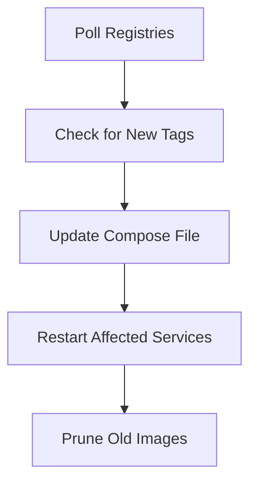

---
[Home](index.md) | [Getting Started](getting-started.md) | [Configuration](configuration.md) | [Usage](usage.md) | [Architecture](architecture.md) | [Docker Compose](docker-compose.md) | [Testing](testing.md) | [FAQ](faq.md) | [Contributing](contributing.md) | [Rules](rules.md)
---

# Architecture

This document provides an overview of DOSync's system architecture and key design concepts.

## High-Level Design

DOSync is designed to:

- Poll container registries for new image tags
- Update Docker Compose files with new tags
- Restart only affected services
- Support both scale-based and name-based replicas
- Work with any Docker Compose YAML and Docker API version

## Replica Detection

DOSync automatically detects service replicas using two strategies:

### Scale-Based Replicas

- Detects replicas created with Compose's `scale` or `deploy.replicas` fields.
- Example:
  ```yaml
  services:
    web:
      image: nginx:latest
      scale: 3
    api:
      image: node:latest
      deploy:
        replicas: 2
  ```

### Name-Based Replicas

- Detects replicas with naming patterns (e.g., blue-green, numbered):
  ```yaml
  services:
    database-blue:
      image: postgres:latest
    database-green:
      image: postgres:latest
    cache-1:
      image: redis:latest
    cache-2:
      image: redis:latest
  ```

## Update Flow



## Docker API Compatibility

- DOSync uses a compatibility helper to work with any Docker daemon version.
- Automatically detects and adapts to the server's supported API version.

See [Configuration](configuration.md) and [Docker Compose Integration](docker-compose.md) for more details.

---

## [⬅️ Usage](usage.md) | [Next ➡️ Docker Compose](docker-compose.md)
